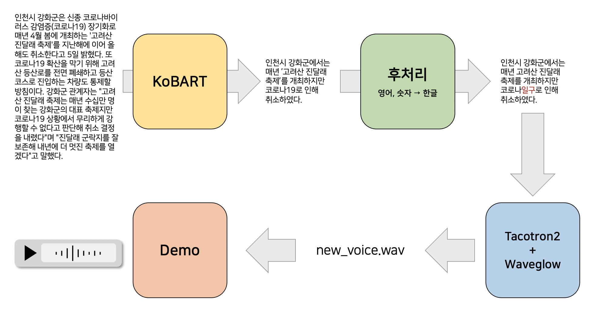

# KoBART Voice Summarization


## 1. Inference Overview



This repo introduces the fine-tuning process of Korean BART (KoBART).

## 2. Environment
Download KoBART using the following command.
```sh
pip install git+https://github.com/SKT-AI/KoBART#egg=kobart
```

Then install packages specified in [requirements.txt](https://github.com/youngerous/kobart-voice-summarization/blob/main/requirements.txt). It can be also installed through [Dockerfile](https://github.com/youngerous/kobart-voice-summarization/blob/main/Dockerfile).


## 3. Code Structure
```sh
# KoBART-summarization related code
src/summarization/
    └─ data/
      └─ cached/ # tokenized indice without special tokens
          ├─ cached_train.jsonl
          ├─ cached_dev.jsonl
          └─ cached_test.jsonl
      ├─ train.jsonl # raw data with many meta-data
      ├─ dev.jsonl
      ├─ test.jsonl
      ├─ processed_train.jsonl # only src, tgt text
      ├─ processed_dev.jsonl
      └─ processed_test.jsonl
    └─ metric/
      ├─ get_rouge.py
      └─ rouge_metric.py
    ├─ 1. data_sample.ipynb
    ├─ 2. tokenizer_sample.ipynb
    ├─ 3. dataset_sample.ipynb
    ├─ 4. inference_sample.ipynb
    ├─ config.py
    ├─ dataset.py
    ├─ distilbart.py
    ├─ inference.py
    ├─ main.py
    ├─ preprocess.py
    ├─ trainer.py
    └─ utils.py
```

## 4. Data and Model

### Text Summarization

- Data: Korean abstractive summarization dataset (released by Bflysoft and publicly opened in [AI Hub](https://aihub.or.kr/aidata/8054))
  - Train 260,697 / Valid 10,000 / Test 10,000 (partially used)
- Model: KoBART, DistilKoBART
  - DistilKoBART is a Korean version of DistilBART, which is proposed in [Pre-trained Summarization Distillation (2020)](https://arxiv.org/abs/2010.13002) paper.

### Voice Synthesis

- Data: [Naver Audioclip](https://audioclip.naver.com/), [Millie's Library](https://www.millie.co.kr)
  - Train 3,752
- Model: Tacotron2, Waveglow

## 5. How to 

### Preprocess

It is required to download ```train.jsonl``` / ```dev.jsonl``` / ```test.jsonl``` in advance  and locate them according to above structure. Then run the following command at ```src/summarization/``` path.

```sh
# train 
python preprocess.py --mode train

# dev 
python preprocess.py --mode dev

# test 
python preprocess.py --mode test
```

### Run
Run the following command at root path.
```sh
sh run_kobart.sh
```

### Inference

```python
from inference import get_summarized_text

ckpt: str = """ Trained checkpoint path """
text: str = """ Text passage to be summarized """
n_enc: int = """ Number of encoder layer (only when using DistilKoBART) """
n_dec: int = """ Number of decoder layer (only when using DistilKoBART) """
summary = get_summarized_text(ckpt, text, n_enc, n_dec)
print(summary)
```

You can check some sample results in [this notebook](https://github.com/youngerous/kobart-voice-summarization/blob/main/src/kobart/4.%20inference_sample.ipynb).

## 6. Results

Videos are recorded in Korean.

- [Proposal Video](https://youtu.be/z6T3j-YmY1w)
- [Midterm Video](https://youtu.be/_BTggEcjYqE)
- [Final Video](https://youtu.be/r9pn577B7mI)

Evaluation metric is from [this link](https://dacon.io/competitions/official/235673/talkboard/401911?page=1&dtype=recent), and models are denoted as ```{model}-{n_enc}-{n_dec}```.

### KoBART-6-6
- Number of Parameters: 123,859,968
  
|           | Rouge-1 | Rouge-2 | Rouge-L |
| :-------: | :-----: | :-----: | :-----: |
| Precision |  0.467  |  0.314  |  0.373  |
|  Recall   |  0.601  |  0.399  |  0.476  |
| F1-Score  |  0.507  |  0.339  |  0.403  |

### DistilKoBART-3-6
- Number of Parameters: 102,596,352

|           | Rouge-1 | Rouge-2 | Rouge-L |
| :-------: | :-----: | :-----: | :-----: |
| Precision |  0.462  |  0.307  |  0.366  |
|  Recall   |  0.587  |  0.385  |  0.461  |
| F1-Score  |  0.496  |  0.327  |  0.392  |

### DistilKoBART-6-3
- Number of Parameters: 95,504,640

|           |  Rouge-1  |  Rouge-2  |  Rouge-L  |
| :-------: | :-------: | :-------: | :-------: |
| Precision |   0.481   |   0.324   |   0.386   |
|  Recall   |   0.582   |   0.386   |   0.464   |
| F1-Score  | **0.510** | **0.340** | **0.408** |


### DistilKoBART-3-3
- Number of Parameters: 74,241,024

|           | Rouge-1 | Rouge-2 | Rouge-L |
| :-------: | :-----: | :-----: | :-----: |
| Precision |  0.472  |  0.314  |  0.378  |
|  Recall   |  0.575  |  0.377  |  0.457  |
| F1-Score  |  0.501  |  0.331  |  0.399  |


### Demo

You can check [demo page](https://youngerous.github.io/kobart-voice-summarization/) for qualitative analysis.

## 7. Members
[Hyeongwon Kang](https://github.com/hwk0702), [Subin Kim](https://github.com/suubkiim), [Jina Kim](https://github.com/jina-kim7), [Takyoung Kim](https://github.com/youngerous)

### Acknowledgement

[Jounghee Kim](https://github.com/JoungheeKim) helped a lot for voice synthesis task.

## 8. Reference

- [[Paper] BART](https://arxiv.org/abs/1910.13461)
- [[Paper] Pre-trained Summarization Distillation](https://arxiv.org/abs/2010.13002)
- [[Repo] KoBART :: SKT-AI](https://github.com/SKT-AI/KoBART)
- [[Repo] KoBART-summarization :: seujung](https://github.com/seujung/KoBART-summarization)
- [[Post] Tacotron2 TTS system :: joungheekim](https://joungheekim.github.io/2021/04/01/code-review/)
- [[Metric] Korean document summarization evaluation metric](https://dacon.io/competitions/official/235673/talkboard/401911?page=1&dtype=recent)
