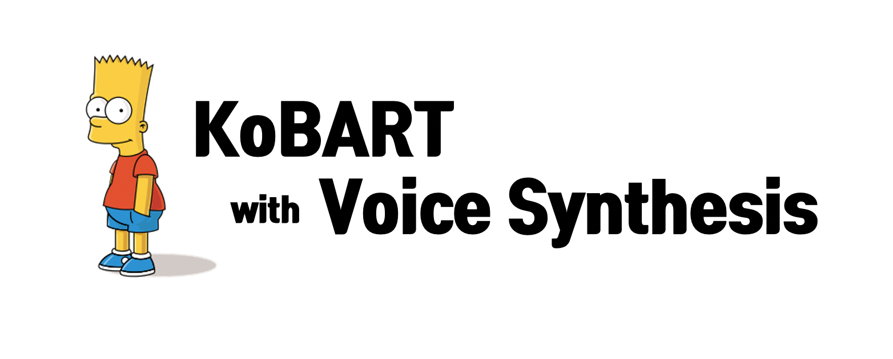

# Kobart Voice Summarization
2021-1 비정형데이터분석 팀프로젝트



## Overview
TBD


## Code Structure
```sh
src/kobart/
    └─ data/
      └─ cached/ # tokenized indice with no special tokens
          ├─ cached_train.jsonl
          ├─ cached_dev.jsonl
          └─ cached_test.jsonl
      ├─ train.jsonl # raw data with many meta-data
      ├─ dev.jsonl
      ├─ test.jsonl
      ├─ processed_train.jsonl # only src, tgt text
      ├─ processed_dev.jsonl
      └─ processed_test.jsonl
    ├─ config.py
    ├─ dataset.py
    ├─ main.py
    ├─ preprocess.py
    ├─ trainer.py
    └─ utils.py
```

## How to Preprocess
```train.jsonl``` / ```dev.jsonl``` / ```test.jsonl```은 미리 다운로드받아 위 구조에 맞게 배치해야 합니다. <br>
```src/kobart/``` 경로에서 아래 명령어를 실행하면 됩니다.

```sh
# train 
$ python preprocess.py --mode train

# dev 
$ python preprocess.py --mode dev

# test 
$ python preprocess.py --mode test
```

## How to Run
```sh
# root 경로에서 실행하면 됩니다.
$ sh run_kobart.sh
```

## Results

### Video
- [제안발표영상]()
- [중간발표영상]()
- [최종발표영상]()

### Demo
TBD

## Reference

- [[Paper] BART: Denoising Sequence-to-Sequence Pre-training for Natural Language Generation, Translation, and Comprehension](https://arxiv.org/abs/1910.13461)
- [[Repo] KoBART :: SKT-AI](https://github.com/SKT-AI/KoBART)
- [[Repo] KoBART-summarization :: seujung](https://github.com/seujung/KoBART-summarization)
